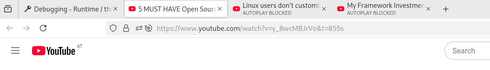

# TabLight

A Firefox (and Firefox forks) plugin, which highlights tabs if you hover over
links you already have open. This helps quickly finding out if you already
opened a link, for example if you have multiple YouTube videos open.

|  | |
| :--- | :--- |
|  |  |

## Try It Out

Currently the extension has to be loaded on the debugging site.
Enter `about:debugging` and click `This Firefox` and `Load Temporary Add-on...`,
select either a file in the tablight folder or the tablight-1.0.zip in
`web-ext-artifacts`.
