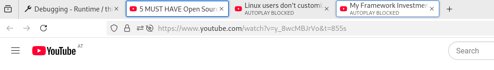

# TabLight

A Firefox (and Firefox forks) plugin, which highlights tabs if you hover over
links you already have open. This helps quickly finding out if you already
opened a link, for example if you have multiple YouTube videos open.

## Installation

The extension is available on the Mozilla addon page. Here is the [link to TabLight](https://addons.mozilla.org/en-US/firefox/addon/tab_light/).

## Screenshots

### Firefox

|  | |
| :--- | :--- |
|  |  |

### Zen Browser

|      |       |
| :--- | :---- |
|  |  |

## Debugging / Development

After cloning the repo, enter `about:debugging` in Firefox and click `This Firefox` and
`Load Temporary Add-on...`, select any file (like manifest.json) from the tablight folder.
